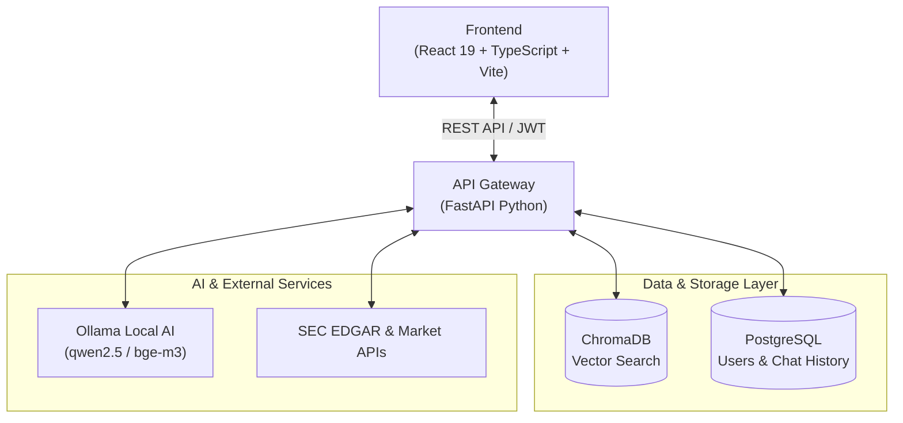
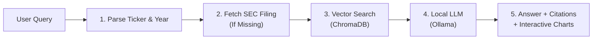

<div align="center">

# Lumina RAG

### *Enterprise-Grade Financial Intelligence & SEC EDGAR RAG Engine*

[](LICENSE)
[](https://python.org)
[](https://fastapi.tiangolo.com)
[](https://react.dev)
[](https://www.typescriptlang.org/)
[](https://vitejs.dev)
[](https://www.postgresql.org/)
[](https://www.trychroma.com/)
[](https://ollama.com)
[](https://www.docker.com/)

---

<p align="center">
  <b>Lumina RAG</b> is an advanced, production-grade Retrieval-Augmented Generation (RAG) platform tailored for SEC financial filings (10-K/10-Q) analysis. Powered by privacy-first local LLMs, vector search, time-aware query reasoning, interactive stock telemetry, and dynamic financial chart synthesis.
</p>

[Key Features](#key-features) •
[System Architecture](#system-architecture) •
[Tech Stack](#tech-stack) •
[Ollama Setup](#ollama-setup--best-practices) •
[Quick Start](#quick-start) •
[API Reference](#api-reference-summary) •
[Environment Configuration](#environment-variables)

---

</div>

## Key Features

### Autonomous SEC EDGAR Pipeline
* **Instant SEC Ingestion**: Resolves company tickers, names, and aliases to SEC Central Index Keys (CIK). Downloads, parses, and indexes raw 10-K HTML filings automatically.
* **Smart Section Breakdown**: Extracts Item 1 (Business), Item 1A (Risk Factors), Item 7 (MD&A), Item 8 (Financial Statements), and more into structural semantically overlapping chunks.
* **Local Embeddings**: Embeds chunks using high-performance local vector models (`bge-m3`, 1024 dimensions) stored in persistent ChromaDB collections.
* **Auto-Healing Storage**: Detects embedding model dimension transitions gracefully, re-indexing vector collections automatically without crashing.

### Time-Aware Query Engine
* **Temporal Intelligence**: Automatically extracts single-year and multi-year ranges (e.g., *"What was Apple's R&D spend between 2021 and 2024?"*) from natural language questions.
* **On-Demand Auto-Ingestion**: If requested financial years are missing from local storage, the backend auto-fetches and indexes required 10-K filings seamlessly before returning the answer.
* **Multi-Company Benchmark**: Compare performance metrics across different corporations side-by-side with structured source attribution.

### Dynamic Financial Visualization & Multi-Modal RAG
* **LLM-Synthesized Charts**: Generates reactive financial charts (Bar, Line, Pie) rendered natively in chat messages using structured JSON outputs via Recharts.
* **Interactive Stock Telemetry**: Mentions of `$TICKER` symbols generate interactive UI elements with hover tooltips displaying real-time market data, price action, and mini sparkline charts via Yahoo Finance.
* **Ad-Hoc Custom Document Upload**: Drag-and-drop custom PDF/TXT financial reports to run hybrid RAG queries alongside SEC EDGAR filings.
* **Executive PDF Report Export**: Export complete chat sessions, verified financial answers, and source citations into clean downloadable executive PDF reports.

### Enterprise Auth & Session Security
* **JWT Token Rotation**: Secure authentication flow with short-lived Access Tokens (15 min) and long-lived HTTP/refresh token persistence (7 days).
* **Google OAuth 2.0**: Single-click social authentication integrating Google ID token server-side validation.
* **Email OTP Verification**: Asynchronous background email dispatching 6-digit verification codes for user registration and password resets.
* **Session Memory & Context Retrieval**: Full session state persistence with automated conversation context inference across multi-turn user queries.

---

## System Architecture



### Retrieval & Generation Pipeline



---


## Tech Stack

| Layer | Technology | Version | Purpose |
| :--- | :--- | :--- | :--- |
| **Frontend Framework** | [React](https://react.dev/) | `19.0` | UI Component Framework |
| **Language** | [TypeScript](https://www.typescriptlang.org/) | `5.0+` | Static Type Safety |
| **Build System** | [Vite](https://vitejs.dev/) | `8.0` | Fast HMR & Frontend Bundler |
| **Styling** | [Tailwind CSS](https://tailwindcss.com/) / Vanilla CSS | `4.0` | Glassmorphic UI & Layout |
| **Animations** | [Framer Motion](https://www.framer.com/motion/) | `12.0+` | UI Page & Component Transitions |
| **Visualization** | [Recharts](https://recharts.org/) | `3.10` | LLM-Generated Financial Charts |
| **Document Export** | `jsPDF` + `html2canvas` | `4.2+` | PDF Executive Report Export |
| **Backend Framework** | [FastAPI](https://fastapi.tiangolo.com/) | `0.110+` | High-Performance Python REST API |
| **ORM & DB** | [SQLAlchemy](https://www.sqlalchemy.org/) + [Alembic](https://alembic.sqlalchemy.org/) | `2.0+` | Relational ORM & Schema Migrations |
| **Primary Database** | [PostgreSQL](https://www.postgresql.org/) | `15.0+` | User Auth, Profiles & Chat History |
| **Vector Store** | [ChromaDB](https://www.trychroma.com/) | `0.5+` | Persistent Vector Embedding Index |
| **Embedding Engine** | [Ollama Embedding (`bge-m3`)](https://ollama.com/library/bge-m3) | `1024 dims` | Dense Vector Representation |
| **Local LLM Engine** | [Ollama LLM (`qwen2.5` / `llama3.1`)](https://ollama.com/library/qwen2.5) | Local | Natural Language Inference & Citation |
| **Auth & Security** | PyJWT + Passlib + Google Auth | Custom | Token Security & OAuth Integration |

---

## Ollama Setup & Best Practices

Lumina RAG operates with **100% local AI inference** via Ollama to ensure complete financial data privacy and zero API token costs.

### 1. Model Installation Commands

1. Download and install [Ollama](https://ollama.com/download).
2. Execute the following terminal commands to pull the necessary models:

```bash
# Download LLM Generation Model
ollama pull qwen2.5

# Download Financial Vector Embedding Model (1024 dimensions)
ollama pull bge-m3

# Verify installed models
ollama list
```

3. Ensure the Ollama background service is operational:
```bash
ollama serve
```

---

### Production Rules for Docker & Ollama

> [!IMPORTANT]
> **Docker Networking Configuration (`host.docker.internal`)**
> When running Lumina RAG in Docker, set your host system's `OLLAMA_HOST` variable so Docker containers can communicate with host ports:
> * Windows / Linux Host: Set environment variable `OLLAMA_HOST=0.0.0.0:11434`
> * Backend Container `.env`: Set `OLLAMA_BASE_URL=http://host.docker.internal:11434`
> * Local Python `.env`: Set `OLLAMA_BASE_URL=http://localhost:11434`

> [!WARNING]
> **Vector Dimension Mismatches**
> ChromaDB collections are locked to their initial embedding dimension. `bge-m3` produces **1024-dimensional** vectors. If you switch models manually, purge vector storage by clearing `./storage/chroma`.

---

## Quick Start

### Prerequisites
* **Docker & Docker Compose** (Recommended) *OR* **Python 3.11+** & **Node.js 20+**
* **Ollama** installed with `qwen2.5` and `bge-m3` pulled

---

### Method A: Docker Compose Deployment (Recommended)

1. **Clone the Repository**
   ```bash
   git clone https://github.com/Pratham082004/Lumina-RAG.git
   cd Lumina-RAG
   ```

2. **Configure Environment Files**
   ```bash
   cp backend/.env.example backend/.env
   cp frontend/.env.example frontend/.env
   ```

3. **Launch Container Services**
   ```bash
   docker compose up --build
   ```

4. **Access Applications**
   * **Web Application**: `http://localhost:80`
   * **API Gateway**: `http://localhost:8000`
   * **Interactive Swagger API Specs**: `http://localhost:8000/docs`

---

### Method B: Manual Local Development Setup

#### 1. Backend Setup

```bash
cd backend

# Create & activate Python virtual environment
python -m venv venv
# On Windows:
venv\Scripts\activate
# On macOS/Linux:
source venv/bin/activate

# Install dependencies
pip install -r requirements.txt

# Execute Database Migrations
alembic upgrade head

# Start Uvicorn Server
uvicorn app.app:app --reload --host 0.0.0.0 --port 8000
```

#### 2. Frontend Setup

```bash
cd frontend

# Install Node modules
npm install

# Start Vite Development Server
npm run dev
```

---

## API Reference Summary

For a detailed list of payloads, request parameters, and schemas, view [**API_REFERENCE.md**](API_REFERENCE.md).

### Core RAG & Ingestion

| Method | Endpoint | Description |
| :--- | :--- | :--- |
| `POST` | `/ingest` | Download, chunk, embed, and index an SEC 10-K filing for a given ticker |
| `POST` | `/ingest/upload` | Upload custom PDF/TXT file for session-level hybrid RAG |
| `POST` | `/chat` | Submit question for RAG answer generation + citations + dynamic charts |

### Authentication & Profile

| Method | Endpoint | Description |
| :--- | :--- | :--- |
| `POST` | `/auth/register` | User signup & dispatch 6-digit OTP email |
| `POST` | `/auth/verify` | Verify email token with OTP code |
| `POST` | `/auth/login` | Authenticate credentials & generate JWT Access/Refresh tokens |
| `POST` | `/auth/google` | Single Sign-On using Google OAuth 2.0 ID Token |
| `PUT` | `/profile/{user_id}` | Update account preferences (investment style, profile) |

### Sessions & Telemetry

| Method | Endpoint | Description |
| :--- | :--- | :--- |
| `GET` | `/history/{user_id}` | Fetch all past chat sessions for authenticated user |
| `GET` | `/history/session/{session_id}` | Retrieve complete message transcript & citations for a session |
| `GET` | `/stocks/{ticker}` | Retrieve live market price, change %, and 30-day sparkline history |
| `POST` | `/contact` | Submit contact form request and email notification |

---

## Environment Variables

### Backend Configuration (`backend/.env`)

```ini
# Application Setup
APP_NAME="Lumina RAG"
APP_VERSION="1.0.0"
DEBUG=True
HOST="0.0.0.0"
PORT=8000

# PostgreSQL Database Connection
DB_HOST="localhost"
DB_PORT=5432
DB_NAME="financial_rag"
DB_USER="user"
DB_PASSWORD="password"

# Ollama AI Configuration
EMBEDDING_PROVIDER="ollama"
LLM_PROVIDER="ollama"
OLLAMA_BASE_URL="http://localhost:11434"
OLLAMA_EMBED_MODEL="bge-m3"
OLLAMA_LLM_MODEL="qwen2.5"

# ChromaDB Vector Store
VECTOR_DB="chroma"
CHROMA_PATH="./storage/chroma"
CHROMA_COLLECTION="financial_rag"
VECTOR_SIZE=1024

# JWT Security Credentials
JWT_ACCESS_SECRET="your-secure-access-secret-key-change-in-production"
JWT_REFRESH_SECRET="your-secure-refresh-secret-key-change-in-production"
JWT_ACCESS_EXPIRES_MINUTES=15
JWT_REFRESH_EXPIRES_DAYS=7

# Google OAuth
GOOGLE_CLIENT_ID="your-google-client-id.apps.googleusercontent.com"

# SMTP Email Configuration (OTP Verification)
EMAIL_HOST="smtp.gmail.com"
EMAIL_PORT=587
EMAIL_USER="your-email@gmail.com"
EMAIL_PASS="your-app-password"
```

---

## Project Structure

```text
Lumina-RAG/
├── README.md                           # Master Documentation & Setup Guide
├── ARCHITECTURE.md                     # Deep Dive Architecture & Flowcharts
├── API_REFERENCE.md                    # Complete OpenAPI Specifications
├── docker-compose.yml                  # Multi-container Orchestration
├── LICENSE                             # MIT Open Source License
├── backend/                            # FastAPI Python Backend Service
│   ├── alembic/                        # Database Migration Scripts
│   ├── app/
│   │   ├── api/                        # REST Controller Endpoints
│   │   ├── database/                   # PostgreSQL Session & Engine
│   │   ├── ingestion/                  # SEC EDGAR Parser & Chunker
│   │   ├── models/                     # SQLAlchemy Database Entities
│   │   ├── repositories/               # Data Access Objects (DAO)
│   │   ├── retrieval/                  # RAG Search & LLM Prompting
│   │   ├── schemas/                    # Pydantic Request/Response Models
│   │   └── services/                   # Stocks API, Email & OAuth Services
│   └── storage/                        # Persistent ChromaDB & Filing Cache
└── frontend/                           # React 19 + TypeScript Frontend
    ├── public/                         # Static Assets & Icons
    └── src/
        ├── components/                 # Reusable UI Panels & Stock Pills
        ├── pages/                      # Application Route Views
        ├── styles/                     # Layout & Theme Styling
        └── utils/                      # API Client & Export Helpers
```

---

## Contributing

Contributions are welcome! Please follow these guidelines:

1. **Fork the Repository**
2. **Create a Feature Branch** (`git checkout -b feature/AmazingFeature`)
3. **Commit your Changes** (`git commit -m 'feat: Add amazing feature'`)
4. **Push to Branch** (`git push origin feature/AmazingFeature`)
5. **Open a Pull Request**

---

## License

Distributed under the **MIT License**. See [`LICENSE`](LICENSE) for more information.

<div align="center">
  <sub>Built by <a href="https://github.com/Pratham082004">Pratham</a> using FastAPI, React 19, and Ollama</sub>
</div>
